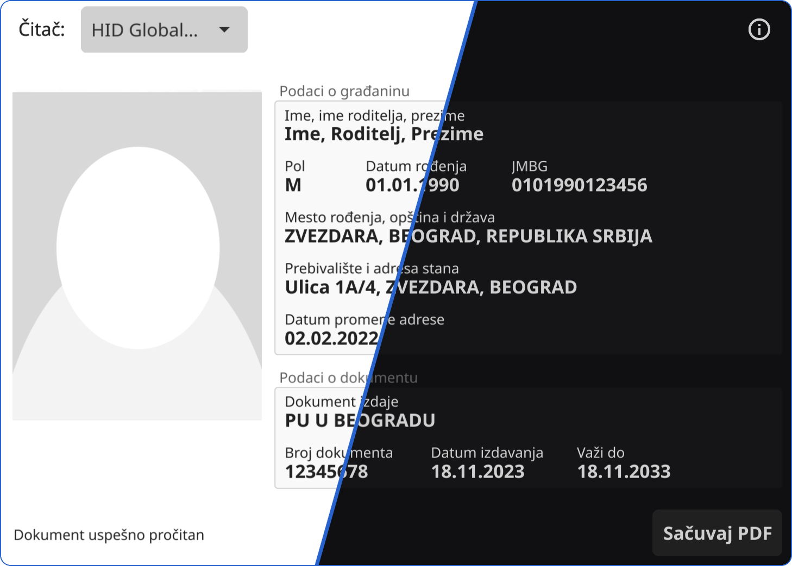

# Baš Čelik

[](https://pkg.go.dev/github.com/ubavic/bas-celik) [](https://goreportcard.com/report/github.com/ubavic/bas-celik)

**Baš Čelik** je čitač elektronskih ličnih karata, zdravstvenih knjižica i saobraćajnih dozvola. Program je osmišljen kao zamena za zvanične aplikacije poput *Čelika*. Nažalost, zvanične aplikacije mogu se pokrenuti samo na Windows operativnom sistemu, dok Baš Čelik funkcioniše na tri operativna sistema (Windows/Linux/OSX).

Baš Čelik je besplatan program, sa potpuno otvorenim kodom dostupnim na adresi [github.com/ubavic/bas-celik](https://github.com/ubavic/bas-celik).

> [!NOTE]
> Baš Čelik is software for reading smart-card documents issued by the government of Serbia. Supported cards include ID cards, vehicle registration cards, and medical insurance cards. The application is written completely from scratch in Go and supports Linux, macOS, and Windows.
> The rest of this document is in Serbian, but the entire codebase is in English, and the interface includes English support.



## Upotreba

Povežite čitač za računar i pokrenite Baš Čelik. Ubacite karticu u čitač. Program će pročitati informacije sa kartice i prikazati ih. Tada možete sačuvati PDF pritiskom na donje desno dugme.

Kreirani PDF dokument izgleda maksimalno približno dokumentu koji se dobija sa zvaničnim aplikacijama.

### Podaci o overi zdravstvene knjižice

Podatak o trajanju zdravstvenog osiguranja (*overena do*), ne zapisuje se na knjižicu prilikom overe. Zvanična RFZO aplikacija preuzima ovaj podatak sa web servisa, i zbog toga je ista funkcionalnost implementirana i u Baš Čeliku. Pritiskom na dugme *Ažuriraj*, preuzima se podatak o trajanju osiguranja. Pri ovom preuzimanju šalje se LBO broj i broj zdravstvene kartice.

### Pokretanje na Linuksu

Baš Čelik zahteva instalirane `ccid` i `opensc`/`pcscd` pakete. Nakon instalacije ovih paketa, neophodno je i pokrenuti `pcscd` servis:

```
sudo systemctl start pcscd
sudo systemctl enable pcscd
```

### Pokretanje u komandnoj liniji

Baš Čelik prihvata sledeće opcije:
 
 + `-atr`: ATR kôd kartice biće prikazan u konzoli. 
 + `-excel PATH`: grafički interfejs neće biti pokrenut, a sadržaj dokumenta biće direktno sačuvan u Excel datoteku (`xlsx`) na `PATH` lokaciji. U Excel datoteku će biti sačuvana samo tekstualna polja, ne i slike.
 + `-help`: informacija o opcijama biće prikazana u konzoli.
 + `-json PATH`: grafički interfejs neće biti pokrenut, a sadržaj dokumenta biće direktno sačuvan u JSON datoteku na `PATH` lokaciji.
 + `-list`: lista raspoloživih čitača biće prikazana u konzoli.
 + `-pdf PATH`: grafički interfejs neće biti pokrenut, a sadržaj dokumenta biće direktno sačuvan u PDF datoteku na `PATH` lokaciji.
 + `-rfzoValidUntil`: informacija o trajanju zdravstvenog osiguranja biće preuzeta sa RFZO portala. Ne odnosi se na grafički interfejs niti na ostala dokumenta.
 + `-verbose`: tokom rada aplikacije detalji o greškama biće prikazani u konzoli.
 + `-version`: informacija o verziji programa biće prikazana u konzoli.
 + `-reader INDEX`: postavlja odabrani čitač za čitanje podataka. Parametar `INDEX` označava prirodan broj koji je naveden u ispisu `list` komande. Izbor utiče samo na čitanje sa `atr`, `excel`, `pdf` i `json` opcijama.

U slučaju `excel`, `json` i `pdf` opcija, program ne dodaje ekstenziju na kraj lokacije koju je korisnik naveo.

Pri pokretanju sa `atr`, `excel`, `json` ili `pdf` opcijom, program očekuje da je kartica smeštena u čitač i neće čekati na ubacivanje kartice kao što je to slučaj sa grafičkim okruženjem.

Pri pokretanju sa `atr`, `help`, `list` ili `version` opcijama podaci sa kartice neće biti očitani (osim ATR koda u slučaju `atr` komande). Program će prestati izvršavanje nakon ispisa odgovarajuće informacije.

### Komandna linija na Windows-u

Izvršna datoteka za Windows koja je dostupna za preuzimanje, je kompajlirana kao GUI aplikacija. Takve aplikacije ne mogu da ispisuju tekst u terminal u kom su pokrenute. Zbog toga, ako želite da vidite ispis u konzoli, potrebno je da preusmerite izlaz aplikacije. Na primer, u powershell-u:

```powershell
bas-celik.exe -help | more
```

### Čitači i drajveri

Baš Čelik bi trebalo da funkcioniše sa svim čitačima pametnih kartica koji su trenutno dostupni u prodaji (Gemalto, Hama, Samtec...). Korisnici Windows (7, 8, 10, 11) i macOS operativnih sistema ne moraju da instaliraju ni jedan dodatni program (drajver).

## Preuzimanje 

Izvršne datoteke poslednje verzije programa možete preuzeti sa [Releases](https://github.com/ubavic/bas-celik/releases) stranice.

Za Linux operativni sistem su dostupne verzije sa i bez grafičkog interfejsa. Verzija sa grafičkim interfejsom je dostupna u okviru datoteke `bas-celik.linux.amd64.tar.xz`. Verzija bez grafičkog interfejsa je dostupna kao izvršna datoteka `bas-celik-cli.linux.amd64`. Obe verzije prihvataju gore navedene opcije komandne linije.

### Izvršne datoteke za macOS

Kako macOS ne dozvoljava (jednostavno) pokretanje izvršnih datoteka koje nisu potpisane sa sertifikatom izdatog od Apple-a, nema mnogo smisla pružati izvršne datoteke za mac. Korisnici Apple uređaja moraju sami instalirati Go (prema uputstvu sa [zvaničnog sajta](https://go.dev/doc/install)), a zatim kompajlirati Baš Čelik po uputstvu navedenom u nastavku.

## Kompilacija

Potrebno je posedovati `go` kompajler. Na Linuksu je potrebno instalirati i `libpcsclite-dev` i [pakete za Fyne](https://developer.fyne.io/started/#prerequisites) (možda i `pkg-config`).

Nakon preuzimanja repozitorijuma, dovoljno je pokrenuti

```
go mod download
go build
```

Prva kompilacija može potrajati nekoliko minuta (i do deset), jer je neophodno da se preuzmu i kompajliraju sve Golang biblioteke. Sve naredne kompilacije se izvršavaju u nekoliko sekundi.

### Kroskompilacija

Uz pomoć [fyne-cross](https://github.com/fyne-io/fyne-cross) programa moguće je na jednom operativnom sistemu iskompajlirati program za sva tri operativna sistema. Ovaj program zahteva Docker na vašem operativnom sistemu.

## Planirane nadogradnje

 + Prikaz detaljima o sertifikatima, i verifikacija podataka na karticama
 + Podrška za dokumente iz susednih država (CG, BiH, HR...)

## Poznati problemi (bug-ovi)

Pregled svih poznatih problema je dostupan na [*Issues* stranici](https://github.com/ubavic/bas-celik/issues).

Unapred sam zahvalan za bilo kakvu povratnu informaciju o problemima. Za prijavljivanje problema, možete otvoriti novi *issue* ili mi poslati mejl (username `celik`, domen `ubavic.rs`).

Eventualni bug u Baš Čelik aplikaciji ne utiče na "sigurnost" vašeg dokumenta. Baš Čelik isključivo čita podatke sa kartice.

### Ćirilica i latinica

Program prikazuje i eksportuje podatke onako kako su zapisani na kartici. Ako na nekom dokumentu uočite podatke na oba pisma, u pitanju nije *bug* već stanje na kartici.

## Arhitektura aplikacije

Aplikacija je podeljena na sledeće pakete:

 + `document` - paket definiše tri tipa `IdDocument`, `MedicalDocument` i `VehicleDocument` koji zadovoljavaju [`Document` interfejs](./document/document.go). Ovi tipovi se koriste kroz celu aplikaciju. Uz definicije tipova, implementirane su i metode za eksport struktura u PDF i JSON.
 + `card` - paket definiše [funkcije za komunikaciju](./card/card.go) sa pametnim karticama i funkcije za parsiranje `Document` struktura iz [TLV](./card/tlv/tlv.go) i [BER](./card/ber/ber.go) datoteka.
 + `internal` - paket sa funkcijama za pokretanje programa, parsiranje argumenata komandne linije, itd... Uključuje i paket `gui` sa definicijom grafičkog interfejsa.
 + `localization` - skup pomoćnih funkcije da za formatiranje datuma, podršku za različita pisma, itd..

Ostali direktorijumi u okviru projekta:
 + `embed` i `assets` - dodatne datoteke. Neke se linkuju u izvršnu verziju prilikom kompilacije.
 + `docs` - interna i eksterna dokumentacija

## Doprinos

Pre kreiranja *issue*-a i *pull request*-ova, pročitati [CONTRIBUTING.md](CONTRIBUTING.md).

## Slični projekti

Postoje i drugi projekti otvorenog koda koji imaju izvesne sličnosti sa *Baš Čelikom*:

 + [JFreesteel](https://github.com/grakic/jfreesteel) i [jevrc](https://github.com/grakic/jevrc) Java programi za čitanje podata sa lične karte i saobraćajne dozvole.
 + [SerbianIdReader](https://github.com/lazarbankovic/serbianIdReader) Rust program za očitavanje ličnih karata.
 + [mup-rs-api-delphi](https://github.com/obucina/mup-rs-api-delphi), [BashChelik](https://github.com/neman/BashChelik) i [Saobracajna.NET](https://github.com/clearpath/Saobracajna.NET) wraperi u različitim jezicima za zvanične MUP-ove biblioteke (sličnost u nazivu sa jednom od biblioteka je slučajna).
 + [golksd](https://github.com/dkozic/golksd) stariji čitač ličnih i saobraćajnih napisan u Golangu.

## Licenca 

Program i izvorni kôd su objavljeni pod [*MIT* licencom](LICENSE).

Font [*Liberation*](https://github.com/liberationfonts/liberation-fonts) je objavljen pod [*SIL Open Font* licencom](assets/LICENSE).
