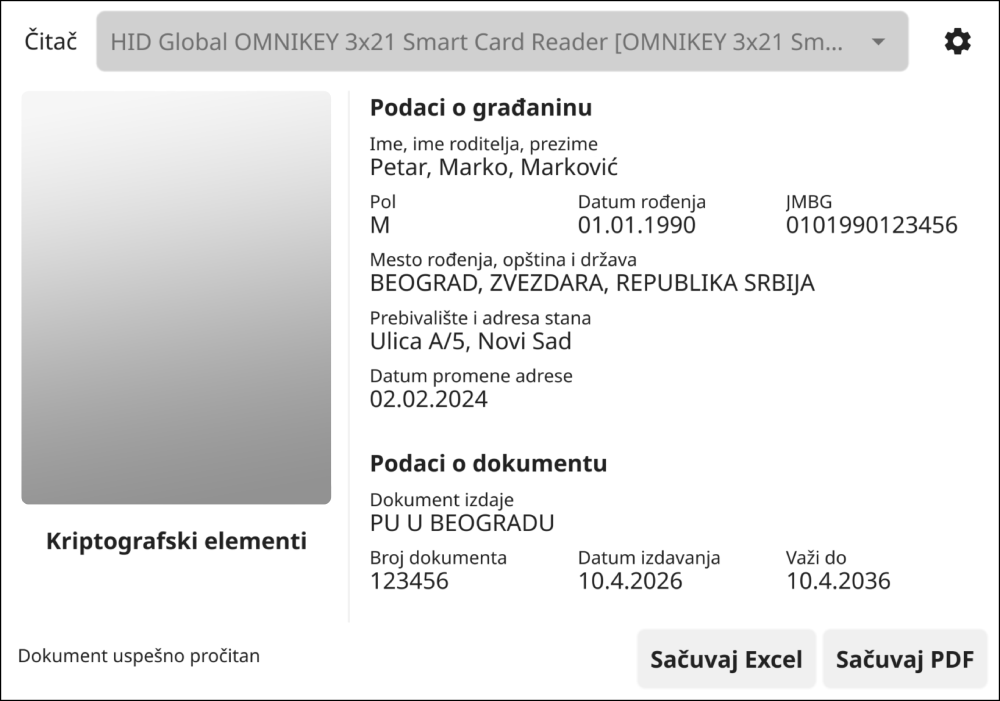

# Baš Čelik

[](https://pkg.go.dev/github.com/ubavic/bas-celik/v2) [](https://goreportcard.com/report/github.com/ubavic/bas-celik/v2)

**Baš Čelik** je čitač elektronskih ličnih karata, zdravstvenih knjižica i saobraćajnih dozvola. Program je osmišljen kao zamena za zvanične aplikacije poput *Čelika*. Nažalost, zvanične aplikacije mogu se pokrenuti samo na Windows operativnom sistemu, dok Baš Čelik funkcioniše na tri operativna sistema (Windows/Linux/OSX).

Baš Čelik je besplatan program, sa potpuno otvorenim kodom dostupnim na adresi [github.com/ubavic/bas-celik](https://github.com/ubavic/bas-celik).

U nastavku su izložene osnovne informacije o programu. Dodatna dokumentacija se može naći u [wikiju](https://github.com/ubavic/bas-celik/wiki) projekta.

> [!NOTE]
> Baš Čelik is software for reading smart-card documents issued by the government of Serbia. Supported cards include ID cards, vehicle registration cards, and medical insurance cards. The application is written completely from scratch in Go and supports Linux, macOS, and Windows.
> The rest of this document is in Serbian, but the entire codebase is in English, and the interface includes English and Russian support. Additional information can be found in the project [wiki](https://github.com/ubavic/bas-celik/wiki).



## Upotreba

Povežite čitač za računar i pokrenite Baš Čelik. Ubacite karticu u čitač. Program će pročitati informacije sa kartice i prikazati ih. Tada možete sačuvati PDF pritiskom na donje desno dugme.

Kreirani PDF dokument izgleda maksimalno približno dokumentu koji se dobija sa zvaničnim aplikacijama.

### Kriptografski elementi

Aplikacija dozvoljava čitanje sertifikata sa lične karte kao i promenu PIN-koda. Čitanje sertifikata sa ostalih dokumenata je u planu.

### eUprava i ePorezi

Baš Čelik *ne* omogućava prijavu na eUpravu i druge državne portale korišćenjem kvalifikovanog elektronskog sertifikata na ličnoj karti. Za te potrebe namenjen je modul [srb-id-pkcs11](https://github.com/ubavic/srb-id-pkcs11).

Baš Čelik može da emulira aplikaciju Smartbox koja se koristi za prijavu na portal [ePorezi](https://eporezi.purs.gov.rs/user/login.html). Smartbox mod se aktivira ili deaktivira kroz korisnička podešavanja. Smartbox box funkcionalnost zavisi od raspoloživih modula za kriptografske tokene; za logovanje sa ličnom kartom može se koristiti `srb-id-pkcs11`.

### Podaci o overi zdravstvene knjižice

Podatak o trajanju zdravstvenog osiguranja (*overena do*), ne zapisuje se na knjižicu prilikom overe. Zvanična RFZO aplikacija preuzima ovaj podatak sa web servisa, i zbog toga je ista funkcionalnost implementirana i u Baš Čeliku. Pritiskom na dugme *Ažuriraj*, preuzima se podatak o trajanju osiguranja. Pri ovom preuzimanju šalje se LBO broj i broj zdravstvene kartice.

### Podešavanja

Podešavanja se otvaraju sa dugmetom koje se nalazi u gornjem desnom uglu aplikacija. Osim teme i jezika, podešavanja imaju sledeće stavke:

+ **Pismo PDF-a** određuje pismo labela u PDF-u lične karte.
+ **Automatsko čuvanje** omogućuje da se PDF dokument automatski sačuva (i otvori u podrazumevanom PDF pregledniku) pri očitavanju kartice.
+ **Lokacija a. čuvanja** označava putanju do postojećeg foldera gde će se PDF dokumenti sačuvati. Mora biti popunjeno da bi automatsko čuvanje radilo.
+ **Pokreni i u pozadini** ako je aktivirano, BašČelik će biti pokrenut kroz system tray.

U okviru podešavanja se može aktivirati i SmartBox mod, kao podesiti putanje ka PKCS#11 modulima.

Restart aplikacije je neophodan da bi podešavanja bila primenjena.

### Pokretanje u komandnoj liniji

Baš Čelik prihvata sledeće opcije:
 
 + `-atr`: ATR kôd kartice biće prikazan u konzoli.
 + `-cyrillic-labels`: PDF lične karte biće kreiran sa ćiriličnim labelama. Ne odnosi se na grafički interfejs niti na ostala dokumenta.
 + `-excel PATH`: grafički interfejs neće biti pokrenut, a sadržaj dokumenta biće direktno sačuvan u Excel datoteku (`xlsx`) na `PATH` lokaciji. U Excel datoteku će biti sačuvana samo tekstualna polja, ne i slike.
 + `-help`: informacija o opcijama biće prikazana u konzoli.
 + `-json PATH`: grafički interfejs neće biti pokrenut, a sadržaj dokumenta biće direktno sačuvan u JSON datoteku na `PATH` lokaciji.
 + `-list`: lista raspoloživih čitača biće prikazana u konzoli.
 + `-pdf PATH`: grafički interfejs neće biti pokrenut, a sadržaj dokumenta biće direktno sačuvan u PDF datoteku na `PATH` lokaciji.
 + `-reader INDEX`: postavlja odabrani čitač za čitanje podataka. Parametar `INDEX` označava prirodan broj koji je naveden u ispisu `list` komande. Izbor utiče samo na čitanje sa `atr`, `excel`, `pdf` i `json` opcijama.
 + `-rfzoValidUntil`: informacija o trajanju zdravstvenog osiguranja biće preuzeta sa RFZO portala. Ne odnosi se na grafički interfejs niti na ostala dokumenta.
 + `-verbose`: tokom rada aplikacije detalji o greškama biće prikazani u konzoli.
 + `-version`: informacija o verziji programa biće prikazana u konzoli.

U slučaju `excel`, `json` i `pdf` opcija, program ne dodaje ekstenziju na kraj lokacije koju je korisnik naveo.

Pri pokretanju sa `atr`, `excel`, `json` ili `pdf` opcijom, program očekuje da je kartica smeštena u čitač i neće čekati na ubacivanje kartice kao što je to slučaj sa grafičkim okruženjem.

Pri pokretanju sa `atr`, `help`, `list` ili `version` opcijama podaci sa kartice neće biti očitani (osim ATR koda u slučaju `atr` komande). Program će prestati izvršavanje nakon ispisa odgovarajuće informacije.

### Čitači i drajveri

Baš Čelik bi trebalo da funkcioniše sa svim čitačima pametnih kartica koji su trenutno dostupni u prodaji (Gemalto, Hama, Samtec...). Korisnici Windows (7, 8, 10, 11) i macOS operativnih sistema ne moraju da instaliraju nijedan dodatni program (drajver). Više o upotrebi na Linux-u dato je na [wiki stranici](https://github.com/ubavic/bas-celik/wiki/Linux).

## Preuzimanje 

Izvršne datoteke poslednje verzije programa možete preuzeti sa [Releases](https://github.com/ubavic/bas-celik/releases) stranice.

## Kompilacija

Potrebno je posedovati `go` kompajler. Na Linuksu je potrebno instalirati i `libpcsclite-dev` i [pakete za Fyne](https://developer.fyne.io/started/#prerequisites) (možda i `pkg-config`).

Nakon preuzimanja repozitorijuma, dovoljno je pokrenuti

```
go mod download
go build -v
```

Prva kompilacija može potrajati nekoliko minuta (i do deset), jer je neophodno da se preuzmu i kompajliraju sve Golang biblioteke. Sve naredne kompilacije se izvršavaju u nekoliko sekundi.

## Arhitektura aplikacije

Aplikacija je podeljena na sledeće pakete:

 + `document` - paket definiše tri tipa `IdDocument`, `MedicalDocument` i `VehicleDocument` koji zadovoljavaju [`Document` interfejs](./document/document.go). Ovi tipovi se koriste kroz celu aplikaciju. Uz definicije tipova, implementirane su i metode za eksport struktura u PDF i JSON.
 + `card` - paket definiše [funkcije za komunikaciju](./card/card.go) sa pametnim karticama i funkcije za parsiranje `Document` struktura iz [TLV](./card/tlv/tlv.go) i [BER](./card/ber/ber.go) datoteka.
 + `internal` - paket sa funkcijama za pokretanje programa, parsiranje argumenata komandne linije, itd... Uključuje i paket `gui` sa definicijom grafičkog interfejsa.
 + `localization` - skup pomoćnih funkcije da za formatiranje datuma, podršku za različita pisma, itd..

Ostali direktorijumi u okviru projekta:
 + `embed` i `assets` - dodatne datoteke. Datoteke iz `embed` se linkuju u izvršnu verziju prilikom kompilacije.
 + `docs` - interna i eksterna dokumentacija

## Doprinos

Pre kreiranja *issue*-a i *pull request*-ova, pročitati [CONTRIBUTING.md](CONTRIBUTING.md).

## Licenca 

Program i izvorni kôd su objavljeni pod [*MIT* licencom](LICENSE).

Font [*Liberation*](https://github.com/liberationfonts/liberation-fonts) je objavljen pod [*SIL Open Font* licencom](assets/LICENSE).
